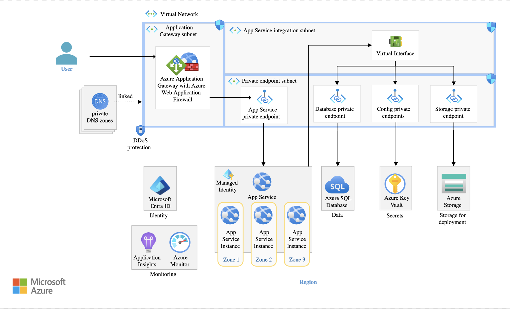

# Create Infrastructure as Code

Your team is tasked with creating a new application that will be deployed to AWS or Azure.

- Create infrastructure as code (IaC) for the application using Terraform or Bicep (in case of Azure)
- Create a CI/CD pipeline for the application using GitHub Actions, Azure DevOps or any other CI/CD tool of your choice.
- Create a README file with instructions on how to deploy the application.

**Azure Design**

**AWS Design**
